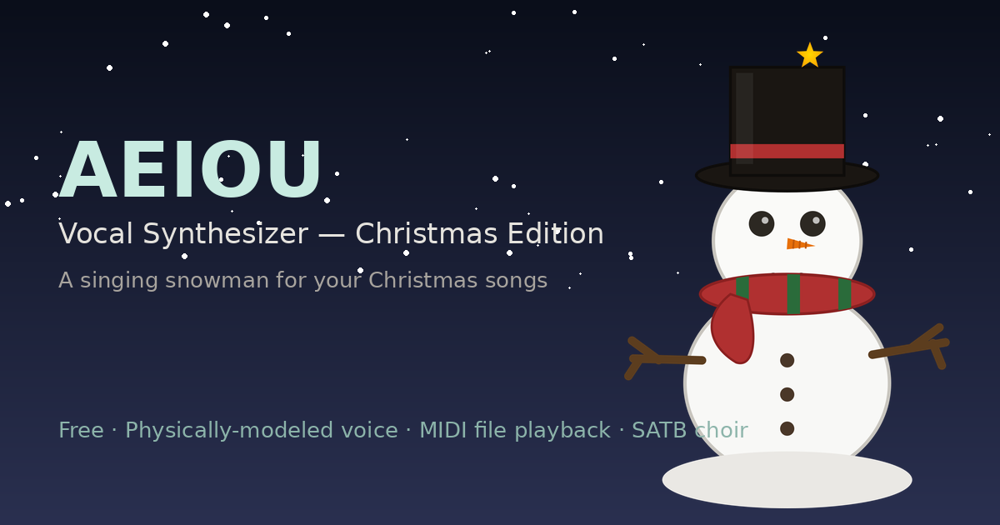

# ❄ AEIOU — Vocal Synthesizer (Christmas Edition)

A physically-modeled singing snowman synthesizer for Christmas, built on the
[Pink Trombone](https://dood.al/pinktrombone/) vocal-tract engine. Play it
live from a keyboard, or load a MIDI file and let it sing a full four-part
(SATB) choir arrangement on its own.

**▶ Try it live:** https://egoaid.github.io/AEIOU/

---

## 日本語

### これは何？

AEIOUは、Neil Thapen氏の**Pink Trombone**(声帯・声道を物理的にシミュレートするエンジン)を核にした、ブラウザで動く「歌う雪だるま」シンセサイザーです。キーボードで生演奏するほか、MIDIファイルを読み込ませれば、音域に応じて自動でソプラノ〜バスの4声(SATB)に振り分けて合唱として再生します。クリスマスパーティーで、その場で讃美歌やクリスマスソングを歌わせるために作りました。

録音済みの声を切り貼りする**サンプルベース方式ではなく**、声帯・声道の運動方程式をリアルタイムに計算する**物理モデリング方式**です。そのためピッチや母音は連続的に滑らかに変化し、🎲 RANDOMIZEで生まれる声も、あらかじめ用意された選択肢からではなく、その場のパラメーターの組み合わせでしか存在しない一回限りの声になります。

### 主な機能

- Pink Trombone(LF声帯モデル＋声道導波管モデル)による物理モデリング歌声合成
- 最大4声ポリフォニー、SATB自動振り分け
- PCキーボード・画面上の鍵盤・MIDIキーボードでの演奏
- MIDIファイルプレーヤー(プレイリスト対応、テンポ自動追従)
- VOICE DNA・VOICE CHARACTER・HUMANIZEによる声質の作り込み
- 29種類の組み込みプリセット(合唱団・ソロボイス・雰囲気・キャラクターなど)
- 録音機能(エンジン出力をそのままWAVファイルとして書き出し)
- **EXTERNAL AUDIO SYNC**: 他のシンセ/ドラムマシーンWebアプリで書き出した音源を読み込み、録音と全く同じタイミングで(録音には含めずに)同時再生。書き出したWAVを同じDAWプロジェクトに読み込めばテンポが揃う
- **🎲 RANDOMIZE**: 声質・エフェクトに関わるほぼ全パラメーターを一括ランダム生成し、「予想もしない声」や「美しい偶然」を発見できる(物理モデリングならではの、あらかじめ用意された選択肢からの選択ではない、無限の組み合わせ)
- 日本語/英語UI切り替え、アプリ内取扱説明書
- PWA対応(ホーム画面に追加してオフラインでも起動可能)

### 使い方

1. 上記リンクをブラウザで開く
2. ▶ STARTボタン、または鍵盤・MIDIキーボードを弾くと音が出ます
3. ヘッダー下のプリセットバーから好みの声色をロード、または🎲 RANDOMIZEでランダムな声を試すこともできます
4. 詳しい使い方はアプリ右上の「📖 取扱説明書」ボタンから確認できます

ローカルで動かす場合は、このリポジトリをクローンして `index.html` を開くだけで動作します。MIDI入力機能はブラウザのセキュリティ仕様上、`https://` または `localhost` 経由でないと使えないため、ローカルサーバー(例: `npx serve` 等)経由での起動を推奨します。

### ライセンス

このプロジェクトは2つのライセンスが混在しています。

- **Pink Trombone(声道エンジン部分)**: © 2017 Neil Thapen、**MITライセンス**
- **それ以外(UI・MIDIプレーヤー・SATB合成・プリセット等すべて)**: © Takeshi Kawamoto、**All Rights Reserved(全著作権留保)**

全著作権留保の部分について、認めているのは次の1点だけです:

> **このアプリをブラウザで使って音楽を作ること、そして作った楽曲・録音・動画を(商用利用も含めて)自由に使うこと。**

一方で、次のことは認めていません:

- アプリ本体(コード)の複製・再配布・改変・改変版の公開(非営利であっても不可)
- 合成された声そのものを単体の製品(サンプルパック・音源・ボイスバンク等)として抜き出し、販売・配布すること

詳細は [LICENSE](LICENSE) を参照してください。

---

## English

### What is this?

AEIOU is a browser-based "singing snowman" synthesizer for Christmas, built
around Neil Thapen's **Pink Trombone** — a physical simulation of the
glottis and vocal tract. Play it live from a keyboard, or load a MIDI file
and it will automatically split the parts into a four-voice (SATB) choir by
pitch range and sing them back to you. It was built to sing carols live at
Christmas parties.

It uses **physical modeling, not sample playback** — the vocal folds and
tract are solved as equations of motion in real time, rather than splicing
and stretching recorded voice clips. Pitch and vowel shape morph completely
continuously as a result, and the voices produced by 🎲 Randomize aren't
picked from a pre-recorded pool — each one exists only for that particular
combination of parameters.

### Features

- Physically-modeled singing voice synthesis (Pink Trombone LF glottal
  source + waveguide vocal tract model)
- Up to 4-voice polyphony with automatic SATB voice allocation
- Play via PC keyboard, on-screen piano, or a MIDI keyboard
- MIDI file player with playlist support and tempo-aware auto-adjustment
- Voice DNA, Voice Character, and Humanize systems for shaping each voice
- 29 built-in presets (choirs, solo voices, atmospheric textures, characters)
- Recording (captures the engine output straight to a WAV file)
- **External Audio Sync**: load an audio file exported from another synth/
  drum-machine web app and play it back in perfect sync with your recording
  — without including it in the recording itself. Import the exported WAV
  into the same DAW project as the external file and the tempo lines up
- **🎲 Randomize**: instantly re-rolls nearly every parameter that shapes
  the voice and effects, for discovering unexpected — sometimes beautiful —
  voices (made possible by physical modeling: not a pick from a preset
  pool, but a genuinely new combination every time)
- Japanese/English UI toggle, with a full in-app manual
- PWA support (installable to your home screen, works offline)

### Usage

1. Open the link above in your browser
2. Click ▶ START, or just play a note on the keyboard / a connected MIDI
   keyboard — either will start the audio engine
3. Load a voice from the preset bar below the header, or hit 🎲 RANDOMIZE
   to roll the dice on something new
4. Full instructions are available from the "📖 MANUAL" button in the header

To run it locally, clone this repo and open `index.html` — that's it, it's
a single self-contained file. MIDI input requires a secure context
(`https://` or `localhost`) per browser security policy, so serving it via
a local static server (e.g. `npx serve`) is recommended if you want to test
MIDI features locally.

### License

This project combines two licenses:

- **Pink Trombone (vocal-tract engine portion):** © 2017 Neil Thapen,
  **MIT License**
- **Everything else** (UI, MIDI player, SATB synthesis, presets, etc.):
  © Takeshi Kawamoto, **All Rights Reserved**

For the all-rights-reserved portion, exactly one thing is permitted:

> **Use this application in your browser to make music, and freely use
> whatever you create with it — songs, recordings, and videos — including
> for commercial purposes.**

The following are **not** permitted:

- Copying, redistributing, modifying, or publishing a modified version of
  the application itself (even non-commercially)
- Extracting or repackaging the synthesized voice as a standalone product
  (e.g. a sample pack, voice bank, or soundfont) for sale or distribution

See [LICENSE](LICENSE) for full details.

---

## Credits

- **Pink Trombone** vocal engine — [Neil Thapen](https://dood.al/pinktrombone/)
  (MIT License)
- Everything else — Takeshi Kawamoto
